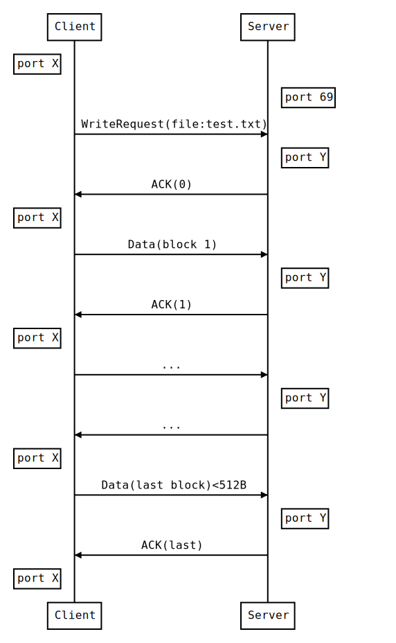

# Vert.x TFTP Client
vertx-tftp-client is a simple  async tftp client which works with vert.x

The Following Java project implements the TFTP protocol and builds a TFTP client. Scope of the client is to upload and download files from a remote TFTP server.
I have used Vert.x to implement this project as asynchronously.

To use this component, add the following dependency to the dependencies section of your build descriptor:

Maven (in your pom.xml):
````
<dependency>
  <groupId>io.github.onemancrew</groupId>
  <artifactId>vertx-tftp-client</artifactId>
  <version>1.0</version>
</dependency>
````

###Creating TFTP Client
````
Vertx vertx = Vertx.vertx();
TftpClient client =new TftpClient(vertx,tftpServerIp,port);//default port 69
``````

###Upload files
````
client.upload("C:\\pp.jpg",(progress)->{
    //progress will update every change in the upload progress.
    },
    (result)->{
    if (result.succeeded()) {
        System.out.println("upload succeeded");
      } else {
        System.out.println("error upload file" + result.cause().getMessage());
      }
});
````

###Download file
````
client.download(fileName,downloadFoler,(result)->{
    (result)->{
        if (result.succeeded()) {
            System.out.println("download succeeded");
          } else {
            System.out.println("error download file" + result.cause().getMessage());
          }
});
````
### Error Code Description
In case of TttpError Exception this id the description for each error code:

| ErrorCode |            Description            |
|:---------:|:---------------------------------:|
|     1     | File not found.                   |
|     2     | Access violation.                 |
|     3     | Disk full or allocation exceeded. |
|     4     | Illegal TFTP operation.           |
|     5     | Unknown transfer ID.              |
|     6     | File already exists.              |
|     7     | No such user.                     |

#### TFTP Upload Protocol:


#### TFTP Download Protocol:
